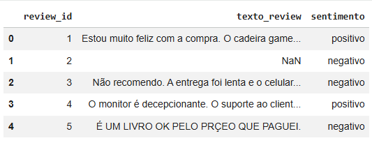
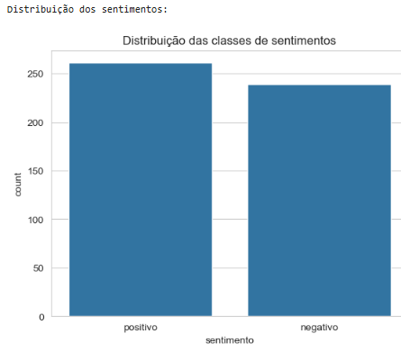
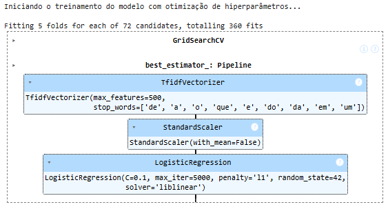
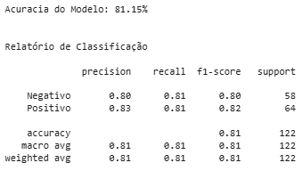
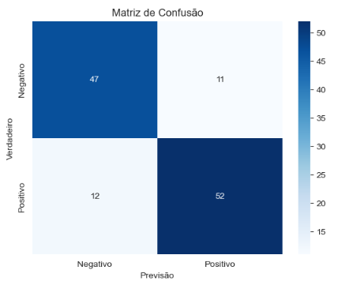

# Sentiment Analysis Model

## Overview
This project provides a comprehensive framework for performing sentiment analysis on textual data. The aim is to classify text inputs into categories such as positive, negative, or neutral based on their sentiment.

- **Visão Inicial dos Dados**: Lemos os dados de uma fonte (um arquivo CSV) para um DataFrame do Pandas e realizamos uma verificação inicial para entender sua estrutura.



- **Gráfico da Distribuição dos Sentimentos**:
 


Nota-se que os dados estão balanceados, o que é ideal para construírmos um modelo de aprendizado de máquina. Se estivessem desbalanceados teríamos que aplicar estratégias como oversample, undersample, dentre outras.

- Depois de realizarmos a análise da distribuição dos sentimentos, foi necessário fazer a limpeza dos dados e a engenharia de atributos, logo após dividimos os dados em treinamento e teste (75% - 25%) e desenvolvemos um pipeline de modelagem preditiva, por fim usamos o GridSearchCV, testamos sistematicamente várias combinações de configurações (hiperparâmetros) para o pipeline, a fim de encontrar a combinação que resulta na melhor performance possível.

- **Treinamento do Modelo**: Nesta etapa, alimentamos o pipeline com os dados de treino. O GridSearchCV executa o processo de .fit(), onde o algoritmo aprende os padrões que conectam o texto dos reviews aos seus respectivos sentimentos.



- **Acurácia do Modelo**: Para finalizar, usamos o conjunto de teste (que o modelo nunca viu) para fazer previsões e compará-las com os resultados reais. Métricas como Acurácia, Relatório de Classificação e a Matriz de Confusão nos dizem quão bem o modelo está generalizando e se ele atende aos objetivos de negócio.



Uma acurácia de 81,15% está ideal para o nosso modelo, se fosse um modelo para área da saúde por exemplo, esse percentual é inaceitável. 
Uma acurácia de 100% pode indicar problemas de overfiting no modelo, pois o ideal é ter um modelo que aprenda o relacionamento geral entre os dados.



As diagonais em azul mostram os acertos do modelo, quanda a classe verdadeira era negativa, o modelo previu negativo 47 vezes, e acertou.
Quando o valor verdadeiro era positivo o modelo previu como positivo 52 vezes e acertou.
A outra diagonal tem os erros do modelo, quando o valor verdadeiro era negativo, ele previu como positivo 11 vezes e errou.
Quando o valor verdadeiro era positivo, ele previu como negativo 12 vezes e errou.

## Project Structure
- **data/**: Contains datasets used for training and testing the model.
- **notebooks/**: Jupyter notebooks for exploratory data analysis and model training.
- **src/**: The source code for the sentiment analysis model.
- **models/**: Pre-trained models and model artifacts.

## Requirements
- Python 3.x
- Libraries: `pandas`, `numpy`, `scikit-learn`, `nltk`, `tensorflow`, `matplotlib`

## Installation
1. Clone the repository: `git clone https://github.com/OseasMonteiro/Modelo_Classificacao_Analise_de_Sentimentos`
2. Install the required libraries: `pip install -r requirements.txt`

## Usage
To train the sentiment analysis model:
```
cd src/
python train_model.py
```

To evaluate the model:
```
cd src/
evaluate_model.py
```

## Dataset
The datasets used are sourced from various online platforms including movie reviews, tweets, and product feedback.

## Acknowledgements
- Special thanks to [source datasets providers] for providing the datasets used in this project.

## License
This project is licensed under the MIT License. See the LICENSE file for details.

## Conclusion
This sentiment analysis model is designed to enable users to gain insights from text data through automatic classification of sentiments. Contributions are welcome via pull requests!